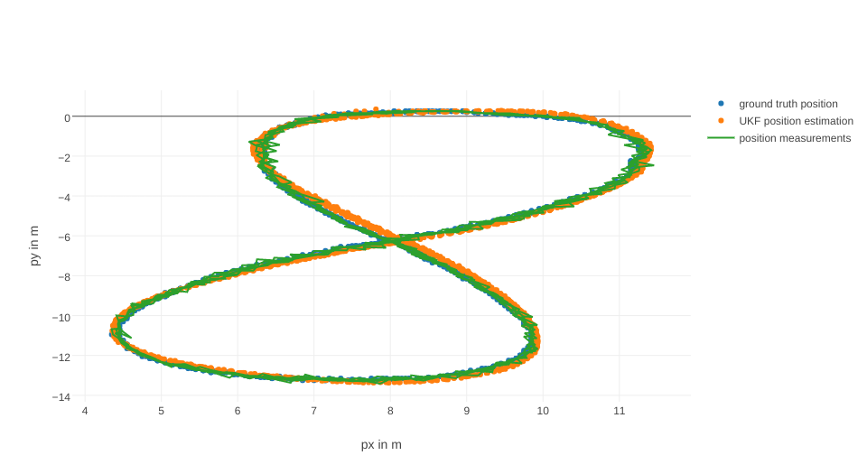
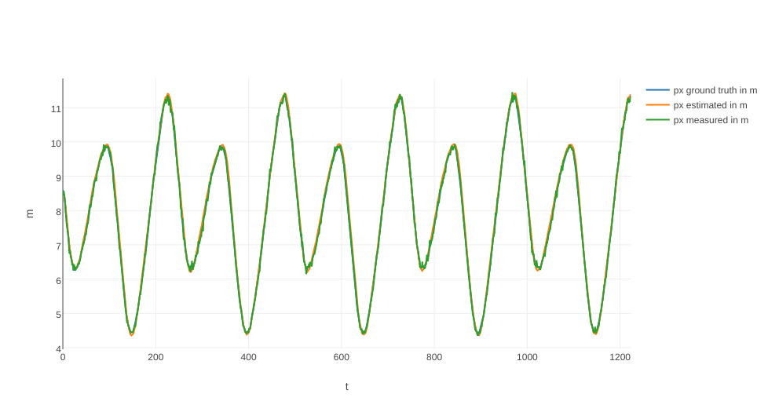
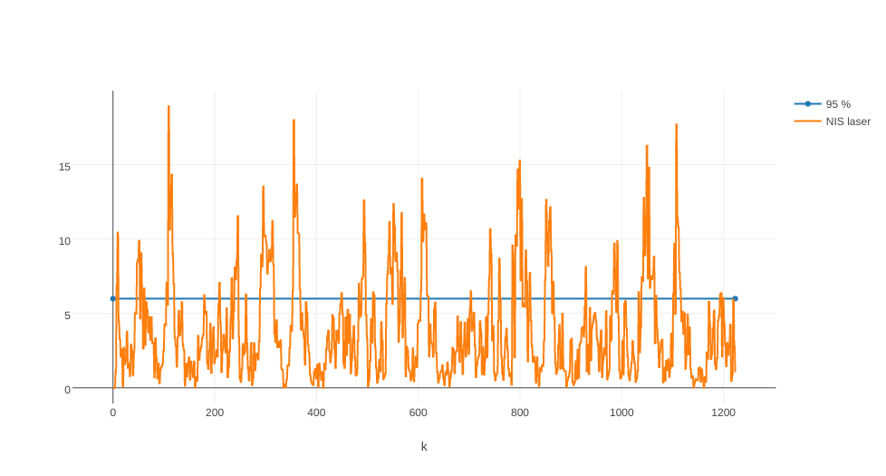
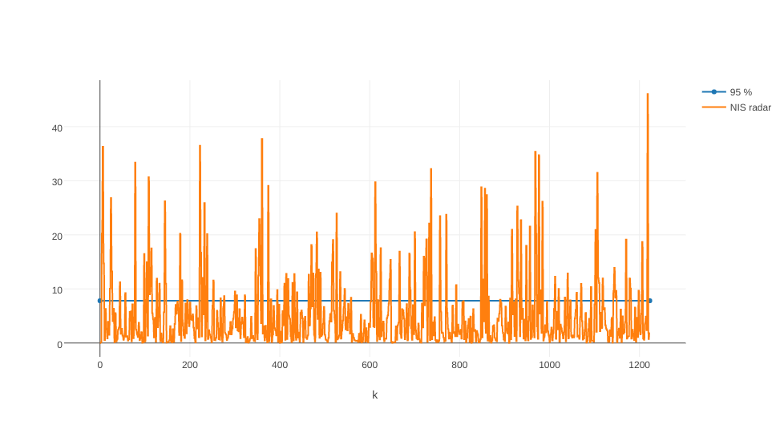
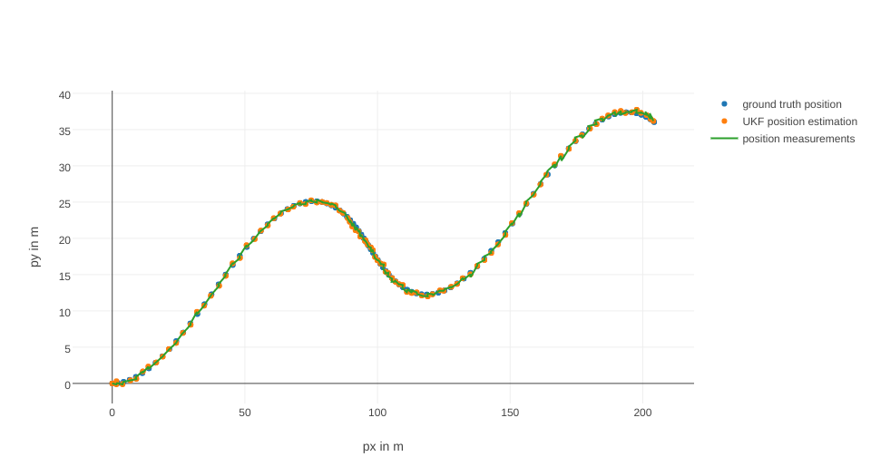
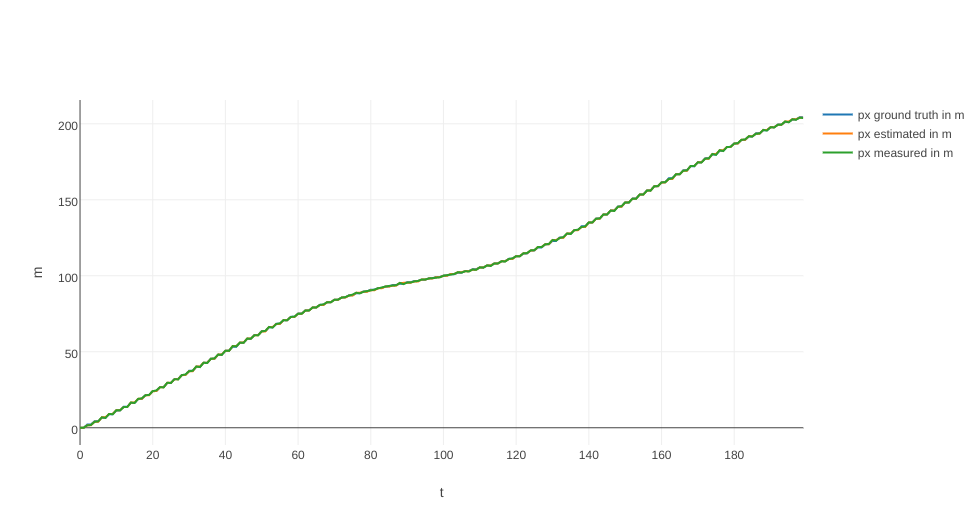
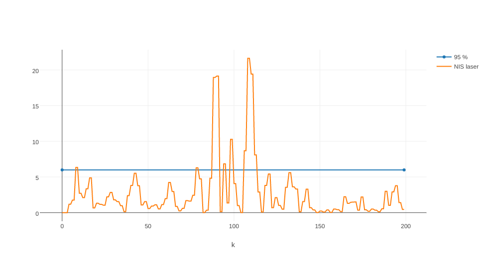
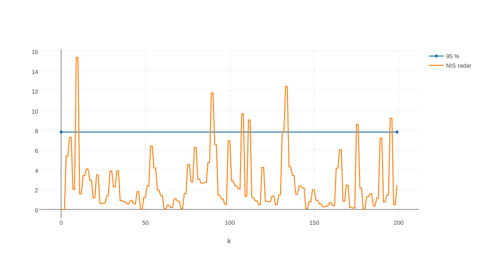

# Unscented Kalman Filter Project Starter Code
Self-Driving Car Engineer Nanodegree Program

---
## Results

Here are the plotted results for the passing submission.

### Data 1

#### Plot





#### NIS Laser



#### NIS Radar



### Data 2

#### Plot





#### NIS Laser



#### NIS Radar



### Parameter

```cpp

  // Process noise standard deviation longitudinal acceleration in m/s^2
  std_a_ = 0.6; //9 or 0.9 or 0.09 or 3 or 0.2

  // Process noise standard deviation yaw acceleration in rad/s^2
  std_yawdd_ = 1.2; //3 or 0.3 or 0.03 or 0.5 or 0.2

  // Laser measurement noise standard deviation position1 in m
  std_laspx_ = 0.1; //0.07

  // Laser measurement noise standard deviation position2 in m
  std_laspy_ = 0.1; //0.07

  // Radar measurement noise standard deviation radius in m
  std_radr_ = 0.3;

  // Radar measurement noise standard deviation angle in rad
  std_radphi_ = 0.03;

  // Radar measurement noise standard deviation radius change in m/s
  std_radrd_ = 0.3;

  // timestamp of last measurement for delta_t
  previous_timestamp_ = 0;

  //set state dimension
  n_x_ = 5;

  //set augmented dimension
  n_aug_ = 7;

  //define spreading parameter
  lambda_ = 3 - n_aug_;

  //set measurement dimension, radar can measure p_x and p_y
  n_y_ = 2;

  //set measurement dimension, radar can measure r, phi, and r_dot
  n_z_ = 3;

  //set example state
  x_ = VectorXd(n_x_);

  //set example covariance matrix
  P_ = MatrixXd(n_x_, n_x_);

  //Initial values
  P_ <<   0.0043, -0.0013, 0.0030, -0.0022, -0.0020,
          -0.0013, 0.0077, 0.0011, 0.0071, 0.0060,
          0.0030, 0.0011, 0.0054, 0.0007, 0.0008,
          -0.0022, 0.0071, 0.0007, 0.0098, 0.0100,
          -0.0020, 0.0060, 0.008, 0.0100, 0.0123;

  //create matrix with predicted sigma points as columns
  Xsig_pred_ = MatrixXd(n_x_, 2 * n_aug_ + 1);

  //set vector for weights_
  weights_ = VectorXd((2*n_aug_+1));

  //initialise weights
  weights_(0)= (-4.)/(3.);

  for (int i=1; i<(2*n_aug_+1); i++) {
    weights_(i) = 0.5/(n_aug_+lambda_);
  }

  //set process noise covariance matrix
  Q_ = MatrixXd(2, 2);
  Q_ <<   std_a_ * std_a_, 0,
          0, std_yawdd_ * std_yawdd_;

  //add measurement noise covariance matrix
  R_radar_ = MatrixXd(n_z_,n_z_);

  R_radar_ << std_radr_ * std_radr_, 0, 0,
          0, std_radphi_ * std_radphi_, 0,
          0, 0,std_radrd_ * std_radrd_;

  R_laser_ = MatrixXd(2, 2);

  R_laser_ << std_laspx_ * std_laspx_, 0,
          0, std_laspy_ * std_laspy_;

  //create sigma point matrix
  Xsig_aug_ = MatrixXd(n_aug_, 2 * n_aug_ + 1);

  //set augmented state
  x_aug_ = VectorXd(n_aug_);

  //set augmented covariance matrix
  P_aug_ = MatrixXd(n_aug_, n_aug_);

  //calculate square root of P_aug
  A_ = P_aug_.llt().matrixL();

  //mean predicted measurement
  z_pred_ = VectorXd(n_z_);

  //measurement covariance matrix S
  S_z_ = MatrixXd(n_z_, n_z_);

  //create matrix for sigma points in measurement space
  Zsig_ = MatrixXd(n_z_, 2 * n_aug_ + 1);

  //mean predicted measurement
  y_pred_ = VectorXd(n_y_);

  //measurement covariance matrix S
  S_y_ = MatrixXd(n_y_, n_y_);

  //create matrix for sigma points in measurement space
  Ysig_ = MatrixXd(n_y_, 2 * n_aug_ + 1);
```

---

## Dependencies

* cmake >= v3.5
* make >= v4.1
* gcc/g++ >= v5.4

## Basic Build Instructions

1. Clone this repo.
2. Make a build directory: `mkdir build && cd build`
3. Compile: `cmake .. && make`
4. Run it: `./UnscentedKF path/to/input.txt path/to/output.txt`. You can find
   some sample inputs in 'data/'.
    - eg. `./UnscentedKF ../data/sample-laser-radar-measurement-data-1.txt output.txt`

## Editor Settings

We've purposefully kept editor configuration files out of this repo in order to
keep it as simple and environment agnostic as possible. However, we recommend
using the following settings:

* indent using spaces
* set tab width to 2 spaces (keeps the matrices in source code aligned)

## Code Style

Please stick to [Google's C++ style guide](https://google.github.io/styleguide/cppguide.html) as much as possible.

## Generating Additional Data

This is optional!

If you'd like to generate your own radar and lidar data, see the
[utilities repo](https://github.com/udacity/CarND-Mercedes-SF-Utilities) for
Matlab scripts that can generate additional data.

## Project Instructions and Rubric

This information is only accessible by people who are already enrolled in Term 2
of CarND. If you are enrolled, see [the project page](https://classroom.udacity.com/nanodegrees/nd013/parts/40f38239-66b6-46ec-ae68-03afd8a601c8/modules/0949fca6-b379-42af-a919-ee50aa304e6a/lessons/c3eb3583-17b2-4d83-abf7-d852ae1b9fff/concepts/4d0420af-0527-4c9f-a5cd-56ee0fe4f09e)
for instructions and the project rubric.
